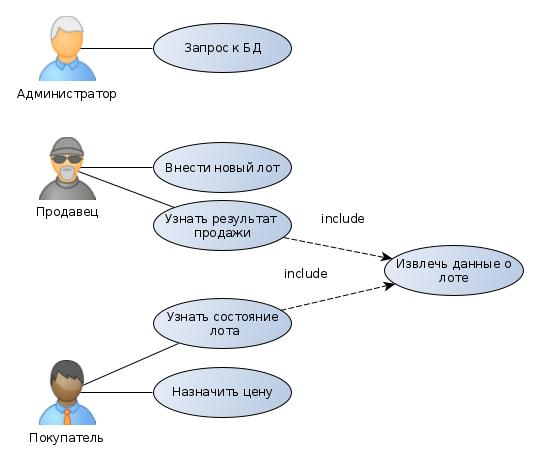

# DB_course_work-network-labs-test_and_debug-labs-
Курсач по базам данных(2020), тема: сервис для аукционов

## Цель работы: 
Разработать пользовательское клиент-серверное приложение для проведения интернет-аукциона.

## Краткие функциональные требования: 
Пользователю доступен список активных лотов, при авторизации он может участвовать в торгах по любому из них, Также он может разместить свой лот. Торги организуются с повышением цены. Пока не истек таймер, пользователь может поднять ставку. При поднятии ставки таймер сбрасывается. Победителем в торге объявляется тот, чья ставка была последней, и при этом истек таймер.

## Use-case диаграмма: 

## ER диаграмма: 

## Ссылка на документацию в Swagger:
https://app.swaggerhub.com/apis/Web_labs/web/1.0.0

## Ссылка на макет (ЛР 2)
https://www.figma.com/file/D110fWl3zl21dXPGDaOvs8/Untitled?node-id=2%3A3
